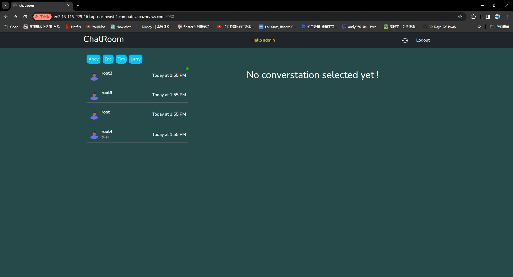

## Introduce

This application provides users with a real-time chat platform and notifies them of unread messages, ensuring users do not miss any important communication.Additionally, it displays the content of the last message, allowing users to read it without opening the message.

This website is built with Node.js, Express.js, Socket.IO and MongoDB Atlas.


## Architecture Diagram


## Demo




## Get Start

### [Link](http://ec2-13-115-229-161.ap-northeast-1.compute.amazonaws.com:3030/)

## Account

You can use the provided usernames and passwords to login:


- Email: root@example.com
- Password: 12345678

- Email: root1@example.com
- Password: 12345678

- Email: root2@example.com
- Password: 12345678


or you can sign up with your own email and password.


## Tech Skills

**Client**: React, JavaScript, HTML, CSS<br>
**Server**: Node.js, Express.js, RESTful API<br>
**Database**: MongoDB<br>
**Cloud Service (AWS)**: EC2<br>
**Others**: Socket.IO, Docker, Git, GitHub Action, JWT


## Features

- Provided users with a real-time chat platform
- Implemented visual notifications for unread messages to ensure users stay informed.
- Enabled the display of currently active users for easy connection.
- Provided message previews, displaying the last message content when messages are unread.
- Enhanced user experience by automatically scrolling to the latest messages upon opening a chat box.


## Usage

1.Clone the repository
```
git clone https://github.com/TheyCallMeAndyBro/chatroom.git
```

2.Move to file
```
cd chatroom
```

3.Install npm packages
```
npm install
```

4.Set environmental variables

```
edit .env 

```

5.Launch the website 
```
npm start - client/server/socket

```

6.Stop
```
ctrl +　ｃ
```


## Future work

- Redis Integration for User Concurrency Status:
  - Implementing Redis to efficiently store and access user concurrency status, enhancing the system's ability to manage user limits effectively.
- Nginx as Reverse Proxy for Frontend, Backend, and Socket Connections:
  - Employing Nginx as a reverse proxy to streamline and optimize connections for frontend, backend, and socket components, ensuring improved performance and scalability.
